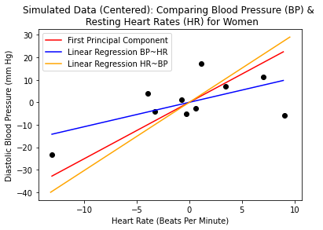

# Linear Algebra Workshop
This is the accompanying code to the course **Linear Algebra** in the [ICME Summer Workshops in Data Science](https://icme.stanford.edu/icme-summer-workshops-2021-fundamentals-data-science#LinAlg) (2021) series, taught by Professor Margot Gerritsen and Laura Lyman. 

* The course is on **Monday, August 2nd** and **Tuesday, August 3rd** from **8:00 - 11:00 am.** 
* This Github repository will be periodically updated before and immediately after the workshop with additional materials, so be sure to occasionally **refresh** this page to have the most relevant information!

The Jupyter notebooks `svd-ellipsoid`, `pca-vs-linear-regression`, and `pca-and-cancer-detection` are provided for you to explore; they can be viewed statically by clicking on the corresponding links above. To use these notebooks *interactively* &mdash; that is, to adjust and execute code blocks, dynamically tune some figure parameters, etc. &mdash; 
you have the options discussed in the following section.

* Using these modules interactively is **not required nor essential for you as a course participant**; rather, the option is given as an additional resource. 
* In the lectures, we will also demonstrate and walk through some of the module highlights on camera.

Each module is meant to be an *introductory, casual, and hands-on exploration* of certain techniques in data science rather than an exhaustive overview of the relevant details. While we will try to make the Jupyter notebooks self-contained in terms of notation and descriptions, they are ultimately supplementary materials that should be viewed in the context of the lectures. 

## Interactive Modules

To adjust code, execute chunks of Python, reproduce results, and play with figure animations/sliders, you have the following options.

1. Configure your personal workspace to run Jupyter notebooks. 

  This is the best choice for interacting with the modules in a long-term manner. You will be able to save any changes you make and run your code more efficiently. There are dozens of tutorials on how to set this up! 
  The cons are that this takes some time and any issues that arise can be very specific to the context of your workspace computer &mdash; for instance, we would not be able to troubleshoot on-the-fly during the Zoom lecture without addressing each person's issues individually. That being said, the techincal solutions are *very often* a quick Google search away! 
  
  
  
  
  
2. Click on the following Binder button  or the link [https://mybinder.org/v2/gh/lalyman/lin-alg-workshop/HEAD](https://mybinder.org/v2/gh/lalyman/lin-alg-workshop/HEAD) directly

  to play with the notebooks in your browser &mdash; no configurations or installations required. Phew! Keep in mind that you cannot save your changes this way.
  
  * After hitting the link, *it takes the Binder service a few minutes to generate the Github repository for your use*, but you should be able to view its progress along the way in the Build Log.
  * If you navigate away from the browser tab, the link will time out at some point and need to be **regenerated** by clicking  again.

## 1. Module `pca-vs-linear-regression`

### 1.1. Introduction

In several situations in science and engineering, we encounter relationships between an input parameter _x_ and an observed output parameter _y_. For instance, _x_ could represent the number of years you have been learning data science, and _y_ could denote your interest in this linear algebra workshop. Perhaps _x_ is the number of hours you have studied linear algebra, and _y_ is the probability of you dreaming about matrices. The possibilities are endless. 

Suppose we can measure _y_ for _m_ different _x_ values. When _x_ and _y_ are  real scalars, we can then plot data points (xi, yi) in the usual two-dimensional way. 

 </img>
 </img>

Sometimes a specific relationship between variables is difficult to spot, such as in the first figure. However, in other instances, there is an approximate linear dependency between _y_ and _x_; in such cases, we can perform linear regression.

**Linear regression** in two-dimensions is a model that assumes a linear relationship between real variables _x_ and _y_ of the general form 

1. _y_ = _a_ + _b_ _x_ (for which we say **_y_ is regressed on x** i.e. _y_ ~ _x_),
2. _x_ = _c_ + _d_ _y_ (for which we say **_x_ is regressed on y** i.e. _x_ ~ _y_),

with _c_ = 1/_b_ and _d_ = -1/_b_.

In the last figure, the red line is referred to as the *best fit straight line* or the *regression line*; this is the linear relationship that estimates the dependency between _x_ and _y_. One of the most common procedures for picking the regression line is **ordinary least squares** (OLS), which we will discuss later in further detail.

In higher dimensions, we consider the single output parameter _y_ in terms of *multiple* properties _x_(1), ..., _x_(n), each of which is measured $m$ times. Multi-dimensional fitting is much harder, particularly if _y_ = _y_(_x_(1), ..., _x_(n)) with _n_ large.
We often first want to reduce the number of variables that _y_ depends on. In other words, we hope to reduce the number of dimensions. 

As a contrived example, suppose we are trying to determine the perimeter _y_ of a rectangle in terms of the explanatory variables width _x_(1) and height _x_(2). Linear regression via OLS would give us the best fit line _y_ = 2 _x_(1) + 2 _x_(2) (which of course we know). However, we can readily find a good dimension reduction. Since
$$ y = 2 x^{(1)} + 2 x^{(2)} = 2(x^{(1)} + x^{(2)}),$$
we can see that _x_(1) and _x_(2) are not independently important for _y_; all that matters is their sum _x_(1) +  _x_(2). We can therefore just work with one parameter _v_(1) = _x_(1) + _x_(2)  and get 

$$ y = 2 v^{(1)} = y(v^{(1)}) .$$
This is performing a *dimension reduction.* Notice how we reduced the number of independent, explanatory variables from 2 to 1.

Here, you saw that _v_(1) can easily be found as a linear
combination of _x_(1) and _x_(2). In general cases, it is not immediately clear what the crticial (linear) combinations of the _x_(j) variables may be. As a result, principal component analysis can come to the rescue.

### 1.2. Principal Component Analysis

**Principal component analysis (pca)** is a linear model that estimates the response variable _y_ in terms of **feature variables** (or **principal components**)  _v_(1), ..., _v_(p), where each feature _v_(j) is itself a linear combination of the _x_(1), ..., _x_(n) and _p_ &le; _n_. That is, the _v_(j) are themselves determined by the original _x_(i) variables. We can think of this as a change of coordinates that re-expresses _y_ in terms of a new, more minimal coordinate system. In the rectangle example, _v_(1) was the principal component. 

The lecture describes *why* pca works in greater detail. In the spirit of keeping this light-hearted, here we only explain *what* the pca procedure is. On a high-level, pca is

* a way of identifying patterns and characterizing the data in such a way as to highlight the similarities and differences
* a key method in data science for summarizing the information at our disposal
* a common procedure for finding patterns in high-dimensional data
* applied in several fields, such as face recognition and image compression.

Given explanatory variables _x_(1), ..., _x_(n) that are each measured $m$ times, we can represent all of our information in the _m_ x _n_ **data matrix** (or **design matrix**) _X_ defined by

$$ X_{i j} = x_i^{(j)} := j\text{th measurement of the $i$th property}. $$

For $n > 1,$ we can then define the **covariance matrix** 

$$ C = \frac{1}{n - 1} X^T X $$

as is often done in introductory statistics. The pca procedure is:

1. Populate the _m_ x _n_ data matrix matrix _X_, where _m_ is the number of measurement types and _n_ is the number of explanatory variables 
2. Subtract off the mean for each measurement type -- in our case, each column of the data matrix X
3. Calculate the principal components and PC scores by
 * Performing an SVD on X (so $X = U \Sigma V^T$), or
 * Performing an eigendecomposition on the covariance matrix _C_ 

The **principal component (PC) scores** are the singular values of _X_; equivalently, they are the square roots of the eigenvalues of _C_, which are guaranteed to be non-negative real numbers by the symmetry of _C_. The PC scores are ranked from largest to smallest, where the "first" PC score refers to the largest value. The **principal components** are the eigenvectors associated with the *nonzero* PC scores (_p_ total), where the "first" principal component is the eigenvector corresponding to the first PC score. These are the _v_(1), ..., _v_(p).

For models of the form _y_ = _a_ + b _x_, there is really no need to perform dimension reduction, since the problem is already low dimensional. However, pca can *still* be handy, since it also helps determine what the principal relations are in a dataset. For such low dimensional examples, principal component analysis is *not* identical to ordinary least squares or linear regression.

### 1.3. Difference Between PCA and OLS

Despite common misconception, the linear models produced by linear regression and pca will still differ in this case. In particular, OLS and pca each pick linear models that minimize the "error" between the actual observed values of _y_ and the _y_-values predicted by the model, i.e. the difference between the blue dots and the fitted red line. The key difference is that OLS and pca define "error" differently. Heuristically,

1. OLS defines error via the distance between a data point and the fitted line in the direction *parallel to the dependent variable axis*. So OLS picks the (unique) fitted line such that the sum of squared distances parallel to the dependent axis is minimized.
    1. If _y_ ~ _x_ (_y_ is regressed on _x_), we regard _y_ as the response variable in the data points _(x, y)_. OLS picks the fitted line such that the sum of *vertical distances* between each data point and the line is as small as possible.
    2. If _x_ ~ _y_ (_x_ is regressed on _y_), we regard _x_ as the response variable in the data points _(x, y)_. OLS selects the fitted line such that the the sum of *horizontal distances* between each data point and the line is minimized.

2. In contrast, pca defines error via the *perpendicular distance* between a data point and the fitted line. That is, pca minimizes the orthogonal projections of the linear approximation onto the actual data.

Unlike linear regression, pca is not checking which characteristics are redundant and discarding them. Instead, pca constructs *new* characteristics that summarize the data well; in particular, these characteristics linear combinations of the original variables. 

To establish the visual and geometric intuition at the heart of these methods, we consider the following numerical example. Aftewards, we explain more specifically how the methods are implemented and which objective functions they are optimizing. For the details on how pca is implemented in practice (e.g. How do we determine the feature variables?), see the module `pca-and-cancer-detection`. 

### 1.2. Numerical Application & Example: Heart health

All code for this section is contained in the Jupyter notebook `pca-vs-linear-regression`.

Suppose we consider resting heart rate (HR) and diastolic blood pressure (BP) data for healthy adolescent women aged 14 - 16. The data was synthetically generated based off the means and standard deviations from actual patient data given in the following [journal article](https://www.ncbi.nlm.nih.gov/pmc/articles/PMC5444886/) by J. Casonatto et al. 

| Heart Rate (Beats Per Minute, BPM) | Diastolic Blood Pressure (mmHg)  |
| ------------- | ------------- |
|  69.57  | 76.90  |
| 71.81  | 66.66  |
|71.62 | 46.56 |
| 58.59 |69.39 |
|65.18 |  62.82 |
| 62.27 | 60.44 |
| 65.96 | 72.60 |
| 59.25 | 60.56 |
| 61.68 | 82.86 |
| 49.48 | 42.08 |

For OLS, there is _p_ = 1 explanatory variable. Similarly, pca determines its linear model from _m_ = 1 principal component. The following plot shows the different linear approximations selected by regression and principal component analysis. (Note that the plotted data is **centered** in the sense that we translated the point cloud to the origin; this does not change the slopes of the linear fits).

In particular, 

1. regressing blood pressure onto heart rate (BP ~ HR) minimizes vertical errors,
2. regressing heart rate onto blood pressure (HR ~ BP) mininmizes horizontal errors, and
3. pca minimizes perpendicular projections/errors.

We can see below that when defining our errors/residuals via OLS, the sum of squared errors is minimized precisely when the linear model matches the regression line.

